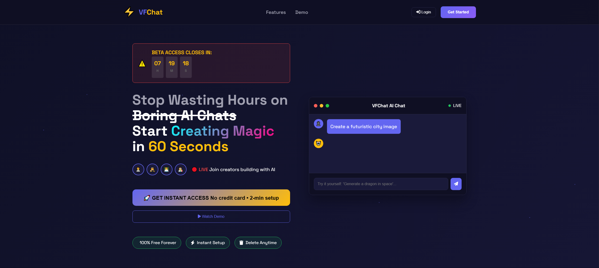
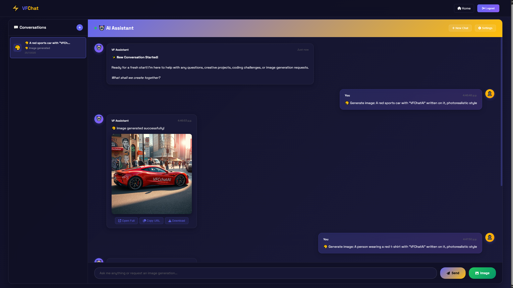
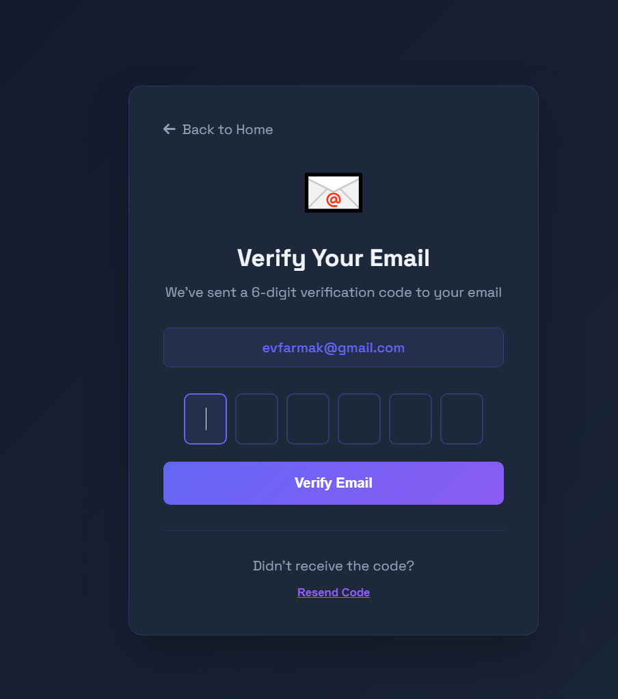
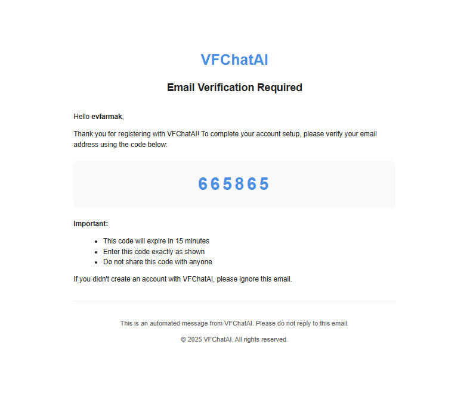

# 🤖 VFChatAI - Modern AI Chat Platform

<div align="center">


[](https://openjdk.org/)
[](https://spring.io/projects/spring-boot)
[](https://www.postgresql.org/)
[](LICENSE)
[](https://github.com/features/actions)

**A streamlined Spring Boot application with AI-powered chat, 2FA email verification, and conversation management.**

· [📖 **Documentation**](https://github.com/V-FARMAKIS/VFChatAi/wiki) · [🐛 **Report Bug**](https://github.com/V-FARMAKIS/VFChatAi/issues) · [💡 **Request Feature**](https://github.com/V-FARMAKIS/VFChatAi/issues)

</div>

---

## 📋 Table of Contents

- [✨ Features](#-features)
- [🏗️ Architecture](#️-architecture)
- [🚀 Quick Start](#-quick-start)
- [📦 Installation](#-installation)
- [🔧 Configuration](#-configuration)
- [🌐 API Documentation](#-api-documentation)
- [🐳 Docker Deployment](#-docker-deployment)
- [🔒 Security](#-security)
- [🧪 Testing](#-testing)
- [🤝 Contributing](#-contributing)
- [📝 License](#-license)

---

## ✨ Features

### 🤖 AI-Powered Chat
- **Google Gemini Integration** - Advanced AI responses using Gemini 1.5 Flash
- **Image Generation** - Image generation using Pollination.ai
- **Real-time Conversations** - Smooth, responsive chat interface
- **Conversation Management** - Save, rename, and organize chat sessions
- **Context Awareness** - AI maintains conversation context across messages

### 🔐 Advanced Authentication
- **Email Verification** - Secure 2FA with SMTP integration
- **Password Security** - BCrypt hashing with configurable strength
- **Session Management** - Secure, stateless session handling
- **Password Reset** - Email-based password recovery system

### 💾 Data Management
- **PostgreSQL Integration** - Reliable, scalable data storage
- **Automatic Migrations** - Database schema versioning
- **Conversation History** - Persistent chat storage and retrieval
- **User Preferences** - Customizable user settings

### 🌐 Modern Web Interface
- **Responsive Design** - Mobile-first, cross-device compatibility
- **Real-time Updates** - Live chat interface with typing indicators
- **Clean UI/UX** - Professional, intuitive user experience
- **Progressive Enhancement** - Works with or without JavaScript

---

## 🔮 Images
### Landing Page


### Chat Page


### Verification Page


### Email Template



---
## 🏗️ Architecture

### Technology Stack

| Layer | Technologies |
|-------|-------------|
| **Backend** | Java 17, Spring Boot 3.2.0, Spring Security, Spring Data JPA |
| **Frontend** | HTML5, CSS3, Vanilla JavaScript, Responsive Design |
| **Database** | PostgreSQL 15+, HikariCP Connection Pool |
| **AI Integration** | Google Gemini API 1.5 Flash |
| **Email** | Spring Mail, SMTP (Gmail, Outlook, Custom) |
| **Security** | BCrypt, CSRF Protection, Session Management |
| **Build Tools** | Maven, Docker, GitHub Actions |

---

## 🚀 Quick Start

### Prerequisites Checklist
- ✅ **Java 17+** installed and configured
- ✅ **PostgreSQL 12+** running on port 5432
- ✅ **Maven 3.6+** for dependency management
- ✅ **Gmail Account** (or SMTP provider) for email verification
- ✅ **Google AI Studio Account** for Gemini API access

### One-Command Setup

```bash
# Clone and start in one go
git clone https://github.com/yourusername/VFChatAI.git && \
cd VFChatAI && \
cp .env.example .env && \
echo "📝 Please edit .env with your credentials, then run: mvn spring-boot:run"
```

---

## 📦 Installation

### 1. Clone the Repository
```bash
git clone https://github.com/yourusername/VFChatAI.git
cd VFChatAI
```

### 2. Database Setup
```sql
-- Create database (if using different name)
CREATE DATABASE vfchatai;

-- Or use default 'postgres' database
-- Username: postgres
-- Password: admin (or your configured password)
```

### 3. Environment Configuration
```bash
# Copy template and configure
cp .env.example .env

# Edit .env with your credentials
nano .env  # or use your preferred editor
```

### 4. Install Dependencies & Run
```bash
# Install Maven dependencies
mvn clean install

# Run the application
mvn spring-boot:run
```

### 5. Access the Application
- **Main Application**: http://localhost:8080
- **Landing Page**: http://localhost:8080/landingpage.html
- **Login Portal**: http://localhost:8080/index.html
- **Chat Interface**: http://localhost:8080/chat.html (after authentication)

---

## 🔧 Configuration

### Environment Variables

#### Required Configuration
```bash
# Email Service (Required for 2FA)
SMTP_HOST=smtp.gmail.com
SMTP_PORT=587
SMTP_USERNAME=your-email@gmail.com
SMTP_PASSWORD=your-app-password

# AI Service (Required for chat)
GEMINI_API_KEY=your-gemini-api-key

# Database (Optional - defaults provided)
DB_USERNAME=postgres
DB_PASSWORD=admin
DB_URL=jdbc:postgresql://localhost:5432/postgres
```

### Getting API Keys

#### Gmail App Password
1. **Enable 2FA** on your Gmail account
2. **Go to Google Account Settings** → Security → 2-Step Verification
3. **Generate App Password** for "VFChatAI"
4. **Use the 16-character password** (not your regular Gmail password)

#### Gemini API Key
1. **Visit [Google AI Studio](https://makersuite.google.com/app/apikey)**
2. **Click "Create API Key"**
3. **Copy the generated key**
4. **Add to your .env file**

---

## 🌐 API Documentation

### Authentication Endpoints

| Method | Endpoint | Description | Request Body |
|--------|----------|-------------|--------------|
| `POST` | `/api/auth/register` | User registration | `{email, password, confirmPassword}` |
| `POST` | `/api/auth/verify-email` | Email verification | `{email, code}` |
| `POST` | `/api/auth/login` | User login | `{email, password}` |
| `POST` | `/api/auth/logout` | User logout | - |
| `POST` | `/api/auth/forgot-password` | Password reset request | `{email}` |
| `POST` | `/api/auth/reset-password` | Password reset | `{token, newPassword}` |

### Chat Endpoints

| Method | Endpoint | Description | Request Body |
|--------|----------|-------------|--------------|
| `POST` | `/api/chat/send` | Send message to AI | `{message, conversationId?}` |
| `GET` | `/api/chat/conversations` | Get user conversations | - |
| `GET` | `/api/chat/conversations/{id}/messages` | Get conversation messages | - |
| `PUT` | `/api/chat/conversations/{id}/rename` | Rename conversation | `{name}` |
| `DELETE` | `/api/chat/conversations/{id}` | Delete conversation | - |

---

## 🐳 Docker Deployment

### Quick Docker Setup
```bash
# Build and run with Docker Compose
docker-compose up -d

# Or build manually
docker build -t vfchatai:latest .
docker run -p 8080:8080 --env-file .env vfchatai:latest
```

---

## 🔒 Security

### Security Features
- **🔐 BCrypt Password Hashing** - Configurable strength (default: 12)
- **📧 Email Verification** - 2FA with time-limited codes
- **🔄 Session Management** - Secure session handling
- **✅ Input Validation** - Comprehensive input sanitization

See [SECURITY.md](SECURITY.md) for detailed security information.

---
## 🤝 Contributing
Please see [Contributing Guide](CONTRIBUTING.md) for details.
---


## 📊 Project Stats

<div align="center">


</div>

### Codebase Metrics
- **Lines of Code**: ~12,000
- **Languages**: ~ Java (35%), JavaScript (5%), HTML/CSS (50%)
- **Dependencies**: 25 (production), 15 (development)

---

## 📚 Resources

### Documentation
- **[API Reference](https://github.com/V-FARMAKIS/VFChatAi/wiki/API-Reference)** - Complete API documentation
- **[Deployment Guide](https://github.com/V-FARMAKIS/VFChatAi/wiki/Deployment)** - Production deployment instructions
- **[Configuration Guide](https://github.com/V-FARMAKIS/VFChatAi/wiki/Configuration)** - Detailed configuration options

### Community
- **[GitHub Discussions](https://github.com/V-FARMAKIS/VFChatAi/discussions)** - Feature requests and Q&A
---

## 📝 License

This project is licensed under the **MIT License** - see the [LICENSE](LICENSE) file for details.

### License Summary
- ✅ **Commercial Use** - Use in commercial projects
- ✅ **Modification** - Modify the source code
- ✅ **Distribution** - Distribute copies of the software
- ✅ **Private Use** - Use privately without restrictions

---

<div align="center">

### 🚀 Ready to Start?

**[📥 Download Latest Release](https://github.com/yourusername/VFChatAI/releases/latest)** · **[📖 Read the Docs](https://github.com/yourusername/VFChatAI/wiki)**


⭐ **Star this repository if you found it helpful!** ⭐

</div>
